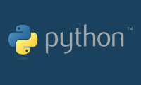

# Curso básico de Python

En este curso aprenderas a programar en Python.

**Requisitos**
- Python 3.6 o superior instalado
- Computadora con Windows, Linux o MacOS
- Editor de texto como [Visual Studio Code](https://code.visualstudio.com/)

---

